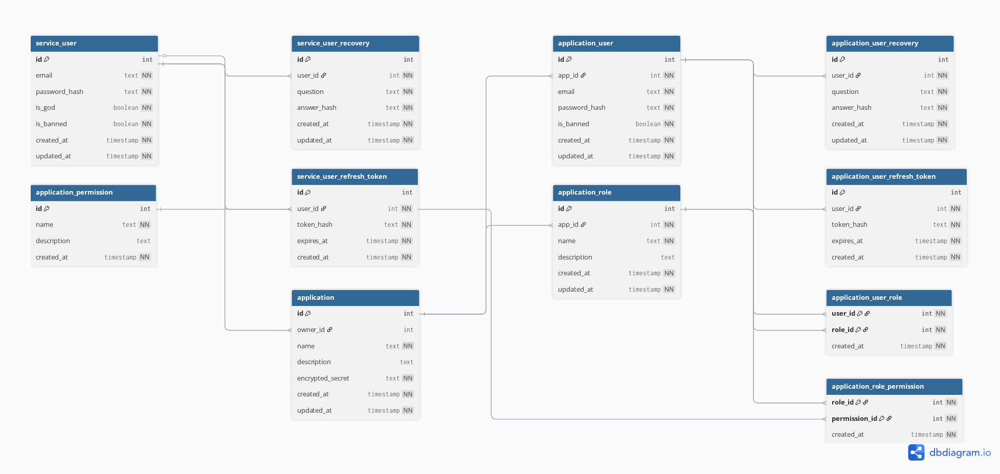

# Backend Auth Service

Проект по реализации сервис аутентификации и управления пользователями, разработанный в рамках стажировки.

Здесь живут пользователи, приложения, роли и токены (˶• ֊ •˶)

## Технологии

- **Фреймворк:** [NestJS](https://nestjs.com/)
- **База данных:** [PostgreSQL](https://www.postgresql.org/)
- **ORM:** [Objection.js](https://vincit.github.io/objection.js/) + [Knex](http://knexjs.org/)
- **Документация:** [Swagger](https://swagger.io/)
- **Линтеры:** [ESLint](https://eslint.org/) + [Prettier](https://prettier.io/)

## Запуск проекта

1. **Установка зависимостей:**
```bash
npm install
```

2. **Настройка переменных окружения:**
Скопируйте файл `.env.example` в `.env`:
```bash
cp .env.example .env
```

Отредактируйте `.env` файл, установив нужные значения:
```env
POSTGRES_PORT=5432
POSTGRES_HOST=localhost
POSTGRES_USER=backend_auth_db_user
POSTGRES_PASSWORD=your_secure_password_here
POSTGRES_DB=backend_auth_db

GOD_USER_EMAIL=god@system.local
GOD_USER_PASSWORD=Arrive.Slabs.Doubt.Research7
JWT_SECRET=DO NOT USE THIS VALUE. INSTEAD, CREATE A COMPLEX SECRET AND KEEP IT SAFE
JWT_ACCESS_TOKEN_EXPIRES_IN=15m
JWT_REFRESH_TOKEN_EXPIRES_IN=7d
```

3. **Запуск базы данных (PostgreSQL):**
```bash
docker-compose up -d
```

4. **Миграции базы данных:**
```bash
npx knex migrate:latest
```

5. **Заполнение начальными данными (seeds):**
```bash
npx knex seed:run
```

6. **Запуск в режиме разработки:**
```bash
npm run start:dev
```

7. **Просмотр API контракта (Swagger):**
После запуска swagger будет доступен по адресу: [http://localhost:3000/api](http://localhost:3000/api) (в случае если не меняли порт по умолчанию)

## Архитектура

### Базы Данных

ERD:



[Посмотреть интерактивную схему на dbdiagram.io](https://dbdiagram.io/d/691c15f16735e111704fbe16)

Ключевые сущности:
- **ServiceUser** - Разработчики/Администраторы сервиса.
- **Application** - Приложения, создаваемые разработчиками.
- **ApplicationUser** - Конечные пользователи (изолированы в рамках Application).
- **ApplicationRole / ApplicationPermission** - Система ролей и прав доступа внутри приложений.

### Слой базы данных

Реализован репозиторный паттерн с использованием Objection.js:

- **Модели (Models):** Определяют структуру таблиц и связи между ними
- **Репозитории (Repositories):** Инкапсулируют логику работы с БД
- **DatabaseModule:** Глобальный модуль, предоставляющий доступ к репозиториям

Основные репозитории:
- `ServiceUsersRepository` - работа с разработчиками
- `AppsRepository` - работа с приложениями
- `AppUsersRepository` - работа с пользователями приложений
- `AppRolesRepository` - работа с ролями
- `AppPermissionsRepository` - работа с разрешениями

## Задания в рамках проекта

| **Задание** | **Дедлайн** | **Статус** |
| --- | --- | --- |
| Инициализация проекта, ERD, контракт для REST API | 30/11/25 | ***Выполнено!*** |
| Реализация работы с БД | 10/12/25 | ***Выполнено!*** |
| Реализация бизнес-логики | 18/01/26 | ***В Процессе!*** |
| Написание юнит-тестов | 23/01/26 | ***Запланировано*** |
| Реализация GraphQL | 3/02/26 | ***Запланировано*** |

## Послесловие

Проект выполняется в рамках стажировки. README будет обновляться и дополняться со временем.
Спасибо за внимание! И продуктивного дня 𐔌՞. .՞𐦯


